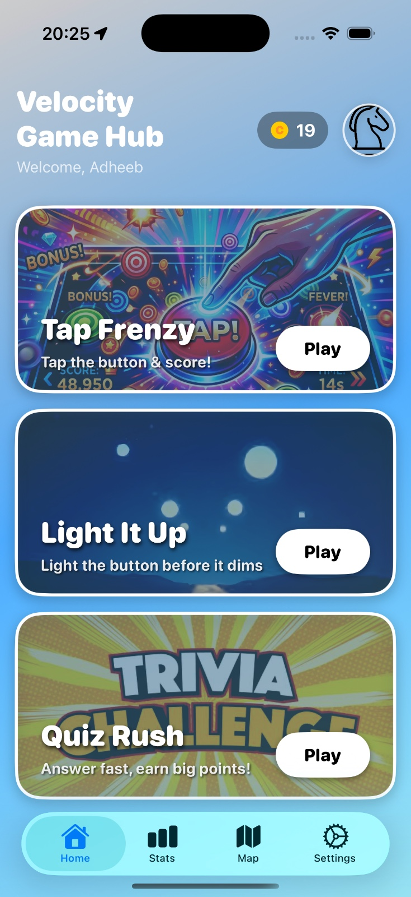
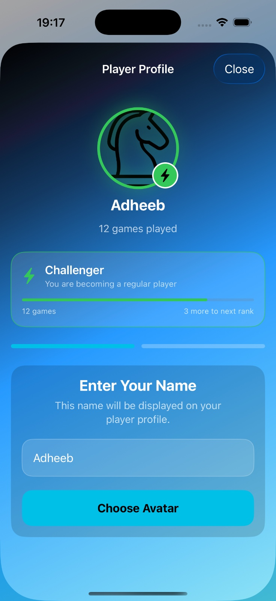
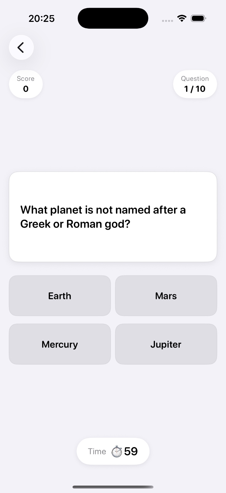
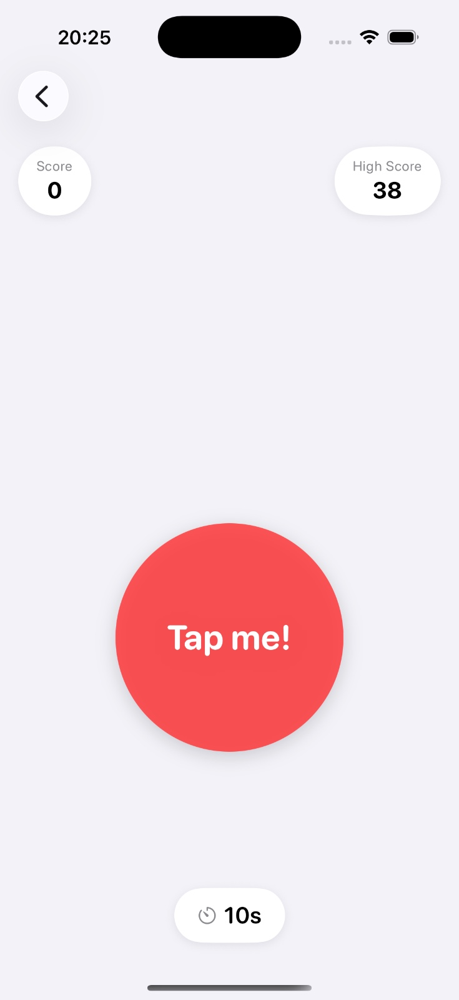
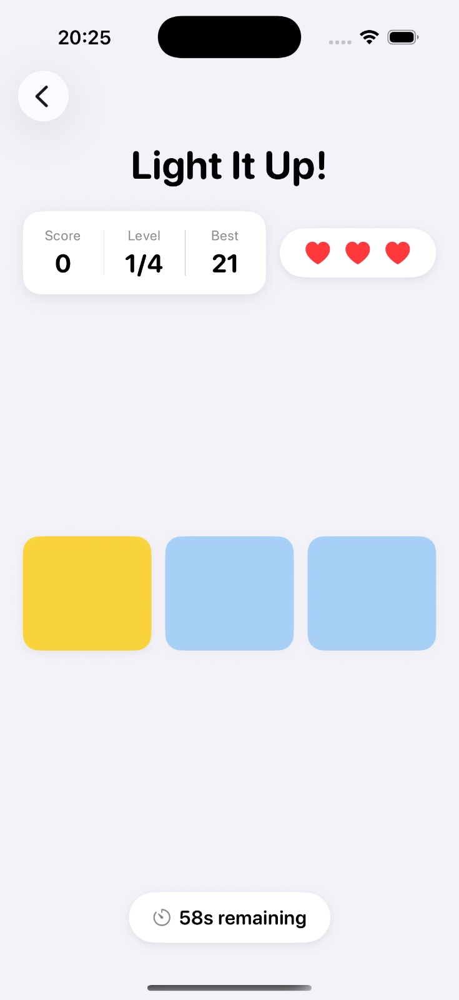
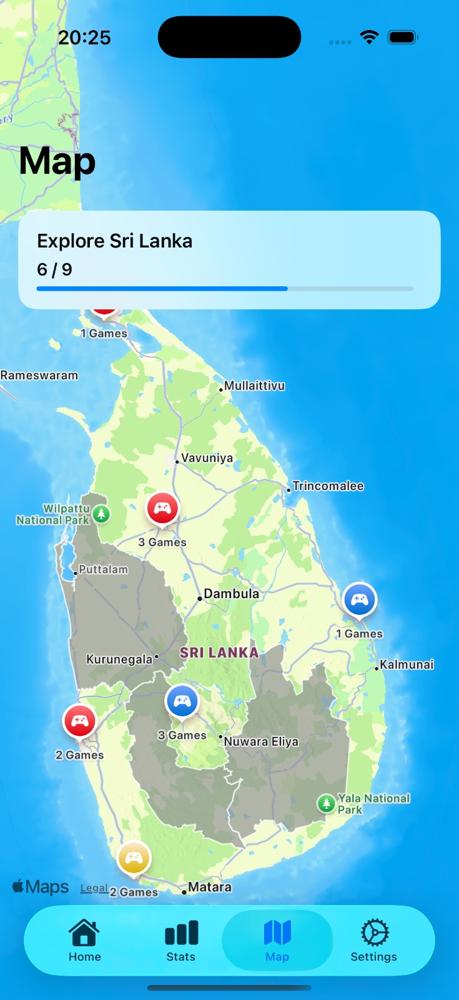

# Velocity Application

Velocity Game Hub is an iOS application developed using SwiftUI as part of the **iOS Application Development** module.

This assessment was completed over a period of **five weeks**, where a new feature or mini-game was implemented each week while following the concepts covered throughout the module.

The objective of the project was to design and develop a multi-game application that demonstrates the use of SwiftUI, the MVVM architectural pattern, location services, local notifications, audio integration, persistent storage, and interactive user interface design.

The application currently consists of three mini-games—**Tap Frenzy**, **Light It Up**, and **Quiz Rush**—along with supporting features such as player profiles, game statistics, province exploration, daily challenges, and a virtual coin system.

---

## Table of Contents

- [Screenshots](#screenshots)
- [Features](#features)
- [Folder Architecture](#folder-architecture)
- [Technologies Used](#technologies-used)
- [APIs](#apis)
- [Installation](#installation)
- [Permissions](#permissions)
- [Credits](#credits)
- [Limitations](#limitations)
- [Reflection](#reflection)

---

# Screenshots


<table cellpadding="20">
  <tr>
    <td align="center">
      <br>
      <b>Home</b>
    </td>
    <td align="center">
      <br>
      <b>Profile</b>
    </td>
  </tr>

  <tr>
    <td align="center">
      <br>
      <b>Quiz Rush</b>
    </td>
    <td align="center">
      <br>
      <b>Tap Frenzy</b>
    </td>
  </tr>

  <tr>
    <td align="center">
      <br>
      <b>Light It Up</b>
    </td>
    <td align="center">
      <br>
      <b>Province Explorer</b>
    </td>
  </tr>
</table>

---

# Features

* Three interactive mini-games: **Tap Frenzy**, **Light It Up**, and **Quiz Rush**.
* Player profile with customizable username and avatar.
* In-game coin system with unlockable avatars.
* Daily challenge system with local notifications.
* Statistics dashboard to track gameplay and high scores.
* Location-based province exploration using MapKit and Core Location.
* Interactive map displaying discovered provinces and played locations.
* Background music and sound effects to enhance gameplay.
* Local data persistence using `UserDefaults` and `AppStorage`.
* Responsive user interface developed with SwiftUI and the MVVM architecture.
* Sharable link to share the scores of the game


---

#  Folder Architecture

A visual breakdown of the directory layout and file architecture for the **iOS-tutorial** application, mapping out the implementation of the MVVM pattern along with core application modules.

```
iOS-tutorial/
├── .gitignore
└── ios application/
    └── ios application/
        ├── App/
        │   └── ios_applicationApp.swift
        ├── Asset/
        ├── Assets.xcassets
        ├── Models/
        │   ├── AvatarData.swift
        │   ├── AvatarItem.swift
        │   ├── DailyChallengeModel.swift
        │   ├── GameModel/
        │   │   ├── LightUpModel.swift
        │   │   ├── QuizResponse.swift
        │   │   └── TapFrenzyModel.swift
        │   ├── GameSessionModel.swift
        │   ├── LocationGroup.swift
        │   ├── PlayerRank.swift
        │   ├── Province/
        │   ├── QuizSettings.swift
        │   └── StatModel.swift
        ├── Services/
        │   ├── DailyChallengeManager.swift
        │   ├── GameSessionManager.swift
        │   ├── GameSound/
        │   │   ├── BlinkSoundManager.swift
        │   │   ├── QuizSoundManager.swift
        │   │   └── TapFrenzySoundManager.swift
        │   ├── LocationManager.swift
        │   ├── NotificationManager.swift
        │   ├── Province/
        │   └── QuizService.swift
        ├── View Model/
        │   ├── CoinManager.swift
        │   ├── Game View Model/
        │   │   ├── BlinkViewModel.swift
        │   │   ├── QuizViewModel.swift
        │   │   └── TapFrenzyViewModel.swift
        │   ├── SettingsViewModel.swift
        │   └── StatViewModel.swift
        └── Views/
            ├── coinBalanceView.swift
            ├── DailyChallengeCover.swift
            ├── GameCardView.swift
            ├── Games/
            │   ├── Blink Game/
            │   ├── GameOverView.swift
            │   ├── QuizRush/
            │   └── Tap Frenzy/
            ├── ProfileSetupView.swift
            └── Tabs/
                ├── HomeView.swift
                ├── MainTabView.swift
                ├── MapView.swift
                ├── SettingsView.swift
                └── StatsView.swift
```
---

# Technologies Used

* Swift
* SwiftUI
* MVVM Architecture
* MapKit
* Core Location
* UserNotifications
* URLSession
* JSONDecoder
* GeoJSON
* AppStorage

---

# APIs

## Open Trivia Database (OpenTDB)

Quiz questions are retrieved from:

https://opentdb.com/api.php

The application decodes JSON responses using Codable and URLSession.

---


# Installation

## Requirements

* macOS
* Xcode 16 or later
* iOS 17 Simulator or later

---

## Steps

1. Clone the repository.

```bash
git clone git@github.com:adheeb-ahamed/iOS-tutorial.git>
```

2. Open the project in Xcode.

3. Select an iOS Simulator.

4. Press **Run** (⌘ + R).

---

# Permissions

The application requires the following permissions:

### Location

Used to save where games were played.

### Notifications

Used for daily challenge reminders.

---

## Credits

This project uses third-party audio assets for educational purposes. All copyrights and trademarks remain the property of their respective owners.

### Audio Credits

| Audio Asset | Attribution |
|-------------|-------------|
| Quiz Background Music | Inspired by the *Who Wants to Be a Millionaire?* soundtrack. Copyright © Celador Productions and the respective copyright holders. |
| Next Question Sound | Inspired by the *Who Wants to Be a Millionaire?* soundtrack. Copyright © Celador Productions and the respective copyright holders. |
| Chip Mode Sound | Audio by **Danijel Zambo**. Used with appropriate attribution. |

> **Disclaimer:** This project was developed solely for educational purposes as part of the **iOS Application Development** module assessment. No copyright infringement is intended, and all audio assets remain the property of their respective copyright owners.

---

# Limitations

- Province unlocking is limited to Sri Lanka.
- Quiz questions depend on the Open Trivia Database API and require an internet connection.
- No user authentication or cloud backup is avaialable.
- Coins are used only to buy avatars, There are no other uses for it. 
- Coins were initially made to buy custom background.
- No online leaderboard
- The application is available in English only.
- There is no tutorial to explain how to play the game.
- The Game ranks are not explained. 

---

# Reflection

I first started this module without any experience using swift. Each week our lecturer gave us games to develop and finally to create a fully fledged application. This was a huge learning experinece. Day by day my knowledge in Swift increased learned new concepts. It took time to convert the ideas to code. Mistakes helped us to get better. It started with how to create a button on the swift to finally creating a full on application with three functional games. I still could improve on my UI honestly. But I feel like I'm satisfied with the output. One of the single hardest thing was not having a Mac device, and using the device that is available on the campus. Coming to campus every single day and coding till the security guard kicks us out. These five weeks have been a great experience. 
